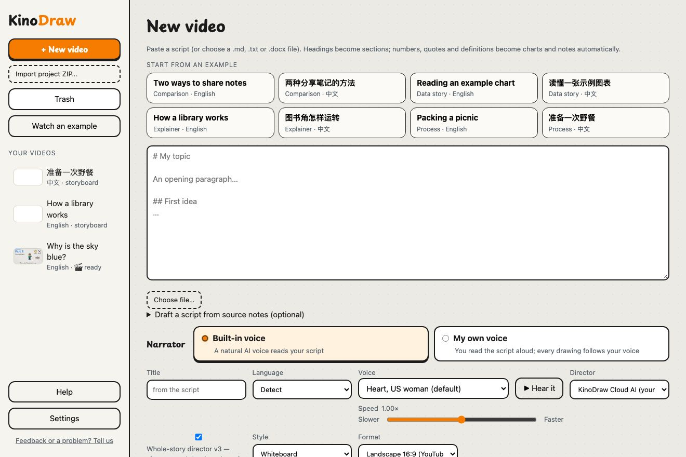
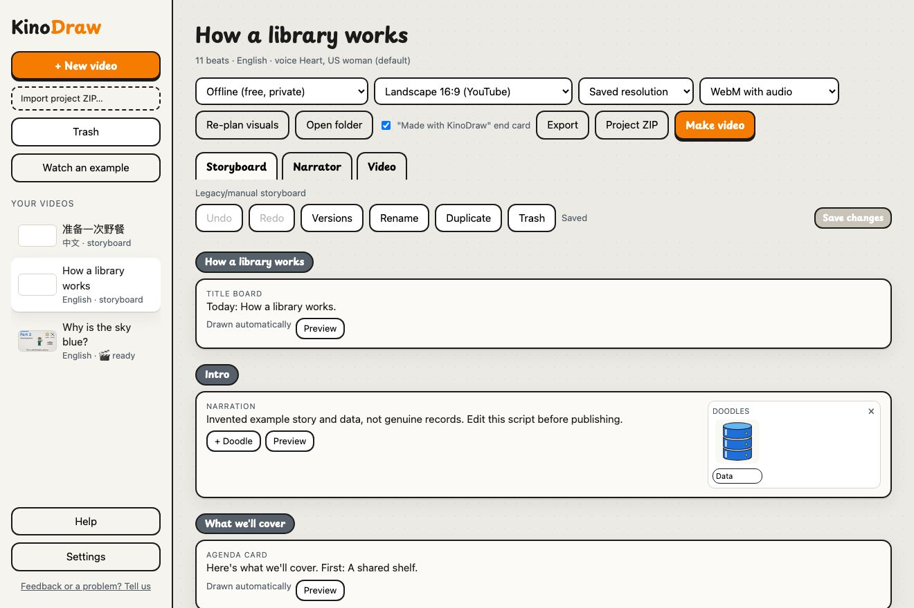
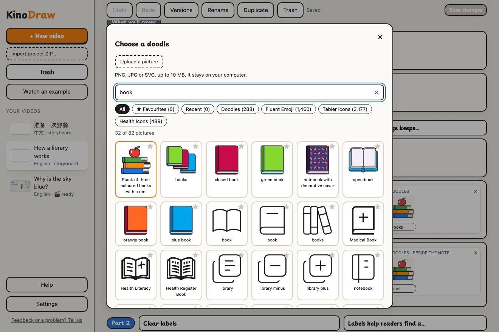
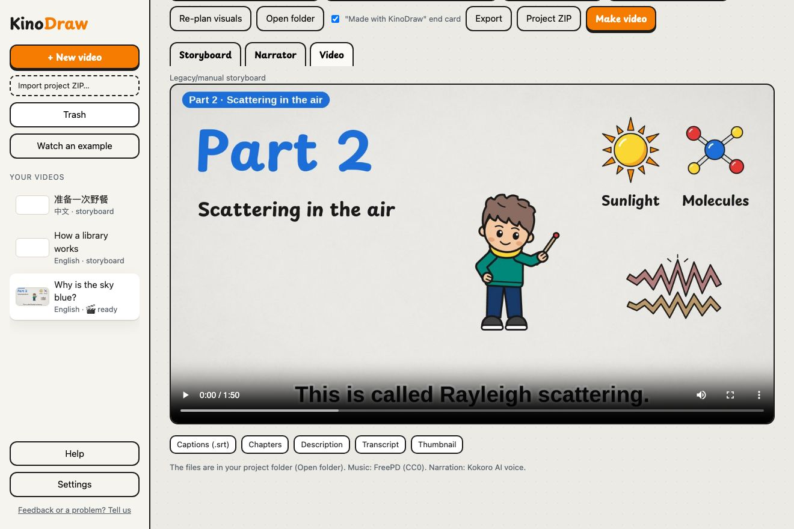

# KinoDraw user guide

[中文版](user-guide.zh.md)

KinoDraw turns a script into a hand-drawn video on your own computer: a hand draws doodles, notes and small charts
while a voice reads your words. This guide follows the app step by step and names each button in bold, as the app
shows it.

## Install and open KinoDraw

1. Download KinoDraw for Windows, macOS (Apple silicon) or Linux from the [releases page](https://github.com/edwardaiwang-svg/kinodraw/releases/latest) and unzip it.
2. Open it. The first time, your computer asks you to approve it once: on a Mac, go to System Settings → Privacy & Security and choose Open Anyway ([pictures of each step](https://edwardaiwang-svg.github.io/kinodraw/#first-open)); on Windows, choose More info → Run anyway.
3. The first time, KinoDraw shows a finished example video; after that it opens your latest video. **Watch an example** shows the example again.

If you installed KinoDraw with Python, `kinodraw studio` opens the same window, and `kinodraw studio --browser`
opens it in your web browser instead.

## Make your first video

1. Press **New video**.
2. Paste your script, press **Choose file…** to open a .md, .txt or .docx file, or pick one of the invented examples under **Start from an example** (the link after them shows the examples in the other language).
3. Check the **Narrator**, the **Style** and the **Format**. **Language**, the **Director**, **Speed** and **Title** are under **More options**. The defaults work.
4. Press **Create storyboard**. KinoDraw plans a picture for each part of your script.
5. Look over the storyboard, then press **Make video**. A 3-minute video takes about 3 minutes to make.

Your first video in a language downloads its voice (about 190 MB, or 220 MB for Chinese) and the doodle search
(about 70 MB, or 95 MB for Chinese), once. After that, everything works offline.

## Write a script

- Start with a `#` title. Each `##` heading becomes a section, listed on the agenda card near the start.
- Write the way you would say it out loud. Numbers, quotes and definitions become charts and notes by themselves.
- A last section called "Conclusion" (or "总结") becomes the ending.
- Scripts can be in English, Chinese or Spanish. **Detect** picks the language from the text.
- **Draft a script from source notes** writes a first draft from facts you paste. It works with a director that uses your own key or program (see the next section). Press **Draft from notes**, then check every fact before you use it.

## Choose who plans the pictures

- **Offline (free, private)** matches the words of each sentence to the pictures on your computer. Nothing is uploaded.
- **KinoDraw Cloud AI (your plan)** sends your whole script to KinoDraw Cloud, which plans the video with AI. No account is needed while the cloud allows it; if it asks, sign in under **Settings** with **Email me a code**. It plans English and Chinese videos; others are planned offline.
- Your own OpenAI, Anthropic or OpenAI-compatible key: turn on **Show directors that use your own API key or program** under **Settings** → **Advanced directors**. Your provider bills you. Keys stay in your computer's keychain.
- **Whole-story director v3** (on by default) plans the cast, the scenes and the style for the whole video.

## Pick a style and a size

- **Style** sets the look: Whiteboard, Chalkboard, Notebook, Pixel Quest, Mosaic, or Paper collage promo. **Choose for me** (the default) lets the director pick. With Paper collage promo or **Choose for me**, you can also fill in a **Product name**, **Website** and **Button text** for a promo under **More options**.
- **Format** is Landscape 16:9, Vertical 9:16 or Square 1:1. You can change it later in the project.
- In a project, the resolution menu next to the format sets the size when you make or export: **Landscape 1080p**, **Landscape 4K**, **Square 1080** or **Portrait 1080**.

## Edit the storyboard

- Type over a section title, its short hook, a takeaway note, or the label under a picture.
- Click a picture to swap it, press **+ Doodle** to add one, or press × to remove one. The arrows change what is drawn first.
- Press **Preview** to see a still of that moment.
- **Undo** and **Redo** step through your changes. The storyboard saves by itself; **Save changes** saves at once.
- **Versions** keeps named copies: **Save named version**, and **Restore** to go back.
- **Rename**, **Duplicate** and **Trash** act on the whole project. **Trash** in the sidebar lists trashed projects; **Restore project** brings one back.
- **Re-plan visuals** asks the chosen director to plan all the pictures again.

In **Choose a doodle**, search in your video's language (English, Chinese or Spanish); small English typos are forgiven. The chips show one
set at a time (**Doodles**, **Fluent Emoji**, **Tabler Icons**, **Health Icons**), your **★ Favourites** (press ★ on
a picture) and your **Recent** pictures. **More** shows the next page. **Upload a picture** adds your own PNG, JPG or
SVG (up to 10 MB); it stays on your computer.

## Choose the narrator

- **Built-in voice**: pick a voice, press **Hear it**, and set the **Speed**. On a project's **Narrator** tab, **Pronunciations** fixes how a word is said (one per line: word = how to say it), then press **Save voice settings**.
- **My own voice**: read the whole script aloud and record it, on your phone or any recorder. Press **Upload a recording**, then **Use it for this video**. KinoDraw marks any sentence it could not find in your recording; record again, or press **Make the video anyway**.
- **Voice server**: under **Settings** → **Voice server**, enter the address and model of your own OpenAI-compatible voice server, press **Test**, turn on **Read scripts with my own OpenAI-compatible voice server**, and press **Save**.

## Get your video

- After **Make video**, the **Video** tab plays the MP4 and links its **Captions (.srt)**, **Chapters**, **Description**, **Transcript** and **Thumbnail**. **Open folder** shows all the files.
- Every video ends with a 2-second "Made with KinoDraw" card. Untick its box in the project to leave it off.
- **Export** makes a **WebM with audio** or a **GIF + audio companion** at the size you chose.
- **Project ZIP** packs the whole project into one file; **Import project ZIP…** opens one as a new project.
- **Settings** → **Projects folder** sets where your projects are kept.

## Keyboard shortcuts

- Ctrl+S (⌘S on a Mac) saves the storyboard; Ctrl+Z undoes and Ctrl+Shift+Z redoes a storyboard change (outside text boxes).
- Esc closes an open window such as **Settings**; Tab and Shift+Tab move between controls and stay inside an open window.
- Press ? (outside a text box) for the list. **Help** also has a **Keyboard shortcuts** button.

## Troubleshooting

> Pages files can’t be read. In Pages, choose File → Export To → Word…, then choose the .docx.

Export the document from Pages as Word, then choose the .docx file.

> Make a video once, then you can hear every voice here.

Voices download with your first video in that language. Make one video, then **Hear it** works.

> Sign in to KinoDraw Cloud first (free: 5 AI videos a month), or choose Offline.

KinoDraw Cloud wants an email sign-in: open **Settings**, press **Email me a code**, type the code and press **Sign in**.
Or choose **Offline (free, private)**.

> Add your OpenAI key under Settings first.

Save your key under **Settings** → **Advanced directors**, or choose another director.

> checksum mismatch; download again

A download was damaged on the way. Make the video again to download it again.

> … is too big (over 10 MB). Make it smaller and try again.

Save the picture smaller, or as a JPG, and upload it again.

> Upload your recording first, or choose the built-in voice.

**My own voice** is chosen but there is no recording yet. Upload one on the **Narrator** tab, or choose **Built-in voice**.

> … isn’t a recording we can play. Voice memos (.m4a), .mp3 and .wav files

Save or export your recording as M4A, MP3 or WAV and upload it again.

> Your recording does not sound like a reading of this script

Record the script as it is written, from start to finish, somewhere quiet.

> Part of the script seems to be missing from your recording

A part was skipped. Read every sentence once through, then upload the new recording.

> Your picture was not placed because the board changed while it uploaded. Choose it again under Your pictures.

The storyboard changed while your picture uploaded. Open **Choose a doodle** again and pick it under **Your pictures**.

> KinoDraw couldn't bring over your Doodle Studio projects, voices and settings yet

Close Doodle Studio, then close and reopen KinoDraw (if it keeps coming back, restart your computer first). Nothing has
been deleted.

> Please tell us using "Feedback or a problem?".

Something unexpected went wrong. Press **Feedback or a problem? Tell us** and say what you were doing.

## Feedback and privacy

- **Feedback or a problem? Tell us** sends nothing until you press **Send**. Then KinoDraw Cloud gets what you typed and ticked, plus the app version, your computer type, language and install ID.
- Offline planning and the built-in voice keep your script on your computer. Planning with KinoDraw Cloud or your own key sends the script to that service, and a voice server receives the text it reads.
- To ask KinoDraw Cloud to delete what it keeps, email privacy@doodlecloud.org with this installation's ID (shown under **Settings** → **KinoDraw Cloud**, or printed by `kinodraw cloud-id`). The [privacy policy](https://edwardaiwang-svg.github.io/kinodraw/privacy.html) has the details.
